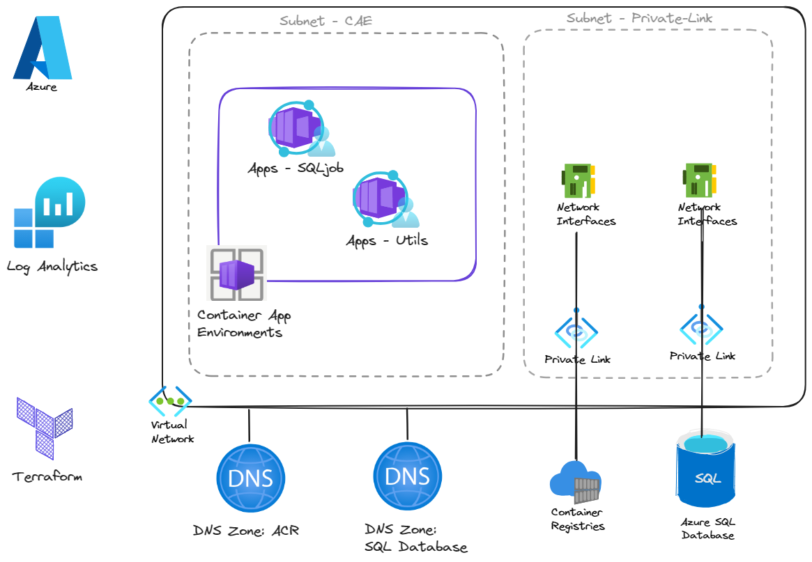

# Azure Container Apps Job Demo with Azure SQL

## Overview
Container Apps Job is a new feature of Azure Container Apps that can run docker containers manually, scheduled or in response to an event. This repo demonstrates how to use Azure Container Apps to run a docker container that executes a simple query against an Azure SQL Database. This demo can be extended into a general purpose SQL job execution environment that can be used for database maintenance, data migration, or data processing

__NOTE:__ _As always, this repo is for demonstration purposes only. It is not intended for production use as is.._

## Components
Component | Usage
------ | ------
Azure Virtual Network | Virtual Network for Azure Container Apps and private endpoints
Azure Container Apps Environment | Automation Account for Runbooks
Azure Virtual Machine | Hybrid Workers
Azure SQL Database | Hosts a simple Todo Database
Azure Container Registry | Hosts the Docker Image
SQL Job App | A docker image with a PowerShell wrapper script that executes a simple query againist the Azure SQL Database
Utils App | A docker image with common utilities for troubleshooting
User Managed Identity | The identity assigned to both Container Apps and given RBAC roles within SQL Azure and Container Registry 

## Architecture Diagram


## Azure Infrastructure Setup 

### Prerequisite
* Azure Subscription with Owner access permissions 
* Use DevContainers, which has all the required tooling, or install the following:
    * [Azure CLI](https://docs.microsoft.com/en-us/cli/azure/install-azure-cli)
    * [Terraform](https://learn.hashicorp.com/tutorials/terraform/install-cli)
    * [Task](https://taskfile.dev/#/installation)

### Automated Steps
```bash
az login
task up -- southcentralus   #Deploys the Azure Infrastructure
task build                  #Builds the docker image and pushes to ACR
task deploy                 #Deploys the SQL job container to ACA
```

### Manual Step
```sql
CREATE USER [${MSI_IDENTITY}] FROM EXTERNAL PROVIDER
ALTER ROLE db_datareader ADD MEMBER [${MSI_IDENTITY}]
ALTER ROLE db_datawriter ADD MEMBER [${MSI_IDENTITY}]
CREATE TABLE dbo.Todos ( [Id] INT PRIMARY KEY, [Name] VARCHAR(250) NOT NULL, [IsComplete] BIT);
INSERT INTO todos VALUES ( 1, 'take out trash', 0)
```
__Notes__: 
* Replace `${MSI_IDENTITY}` with the Managed Identity Object ID
* The above steps can be automated using the ./scripts/setup-sql.sh script.  The script will set the current logged in user as the default admin of the SQL Server.
* `task sql` can now be used to run the above SQL commands

## Validate
```bash
az login
task validate
```
__Notes__: 
* It can take up to 5 minutes or more for the validation to complete and the logs to enter the Azure Log Analytics workspace.

### Example Run
```bash
task: [validate] az containerapp job start -g cub-50718_rg --name cub-50718-sqljob -o table
Name                      ResourceGroup
------------------------  ---------------
cub-50718-sqljob-2n95790  cub-50718_rg
task: [validate] echo "Sleeping for 1 minute…"
Sleeping for 1 minute…
task: [validate] sleep 60s
task: [validate] az containerapp job execution list -g cub-50718_rg -n cub-50718-sqljob -o table
Name                      StartTime                  Status
------------------------  -------------------------  ---------
cub-50718-sqljob-l6ce8h3  2024-03-13T03:57:01+00:00  Succeeded
cub-50718-sqljob-zyiio3g  2024-03-13T03:34:06+00:00  Succeeded
cub-50718-sqljob-wwuss1k  2024-03-13T03:03:47+00:00  Succeeded
task: [validate] echo "Sleeping for 5 minutes…"
Sleeping for 5 minutes…
task: [validate] sleep 300s
task: [validate] az monitor log-analytics query -w ... --analytics-query "ContainerAppConsoleLogs | where ContainerGroupName startswith 'cub-50718-sqljob' | project TimeGenerated, ContainerImage, ContainerGroupName, Log" -o table
cub-50718-sqljob-2n95790-ppmlq  cub50718acr.azurecr.io/sql-job:682acb05  Resolving hostname...cub-50718-sql.database.windows.net: 10.226.1.6              PrimaryResult  2024-03-13T03:59:10.141Z
cub-50718-sqljob-2n95790-ppmlq  cub50718acr.azurecr.io/sql-job:682acb05                                                                                   PrimaryResult  2024-03-13T03:59:11.269Z
cub-50718-sqljob-2n95790-ppmlq  cub50718acr.azurecr.io/sql-job:682acb05  Name                                                                             PrimaryResult  2024-03-13T03:59:11.276Z
cub-50718-sqljob-2n95790-ppmlq  cub50718acr.azurecr.io/sql-job:682acb05  ----                                                                             PrimaryResult  2024-03-13T03:59:11.276Z
cub-50718-sqljob-2n95790-ppmlq  cub50718acr.azurecr.io/sql-job:682acb05  take out trash                                                                   PrimaryResult  2024-03-13T03:59:11.276Z
cub-50718-sqljob-2n95790-ppmlq  cub50718acr.azurecr.io/sql-job:682acb05                                                                                   PrimaryResult  2024-03-13T03:59:11.293Z
```

### Destroy Azure Automation Environment
```bash
az login
task down
```
